[//]: # (Image References)

[//]: # (Image References)

[image1]: https://thumbs.gfycat.com/ChubbyConventionalBrontosaurus-size_restricted.gif "Trained Agent"

# •	Detailed Environment Description

In this project we have used the environment « MountainCar v0 », we aim to train an agent to drive 
up the mountain on the right; however, the car's engine is not strong enough to scale the mountain 
in a single pass. Therefore, the only way to succeed is to drive back and forth to build up 
momentum.

![Trained Agent][image1]
 
the agent has to learn how to select the best action in a  specific state from the action space. We 
have three discrete actions.

   
Actions :
- **`0`** - Push left.
- **`1`** - Push right.
- **`2`** - No action.
  
States:

- **`0`** - Car position [-1.2, 0.6]
- **`1`** - Car velocity [-0.07, 0.07]
         
Rewards:

Scalar value (-1) for every step taken

# •	The learning algorithms

DQN is a value-based temporal difference (TD) algorithm that approximates the Q-function. The learned Q-function is then used by an agent to select actions. DQN is only applicable to environments with discrete action spaces.
1. Experience replay
    Experience replay will help us handle two things:
                   
     ● Avoid forgetting previous experiences: At each time step, we receive a tuple (state, action, reward, new_state). We learn from it (we feed the tuple in our neural network), and then throw this experience => our neural network tends to forget the previous experiences as it overwrites with new experiences.

    ● Reduce correlation between experiences: the data used to compute a single parameter update is often from a single episode, whereas future states and rewards depend on previous states and actions. This can lead to high variance in parameter updates.The replay buffer contains a collection of experience tuples (S, A, R, S′). The tuples are gradually added to the buffer as we are interacting with the environment. An 
    experience replay memory stores the kmost recent experiences an agent hasgathered. If memory is full the oldest experience is discarded to make space for the the latest one. Each time an agent trains, one or more batches of data are sampled random-uniformly from the experience replay memory. Each batch will typically contain experiences from different episodes and different policies, which decorrelates the experiences used to train an agent. In turn, this reduces the variance of the parameter updates, helping to stabilize training.
2. Target network

    Recall the Q-learning update function:
                     
    Q(St,At) ← Q(St,At) + ɑ (Rt+1 + γ maxa Q(St+1 ,a)(St,At)

    To update the weights w of the network Q we use the following update function:

     Δw = ɑ(Rt+1 + γ maxa Q(St+1 ,a, w) - Q(St,At,w)) ▽w Q(St,At, w)

    How could this make it possibly to converge? the TD target is estimated with the same neural network that is updated, in other words, we are getting closer to our target but also moving our target! This can make it a lot harder for our network to converge.Network is chasing its own tail.

    ⇒ We need to Fix the function parameter used to generate the target while changing it for a certain number of learning steps.

     To update the weights w of the network Q we use the following update function:

     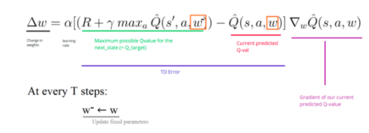

3. Algorithm :

   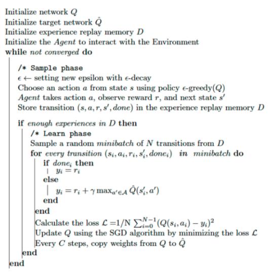

4. DQN improvemnts
    Duel DQN:

    Q(s,a) = V(s) + A(s,a)
    Network will have two separate paths for value of state distribution and advantage distribution. On the output, both paths will be summed together, providing the final value probability distributions for actions.
    - V(s): the value of being at that state

    - A(s,a): the advantage of taking that action at that state (how much better is to take this action versus all other possible actions at that state).
    
    By decoupling the estimation, intuitively our DDQN can learn which states are (or are not) valuable without having to learn the effect of each action at each state (since it’s also calculating V(s)).
    This is particularly useful for states where their actions do not affect the environment in a relevant way.
    

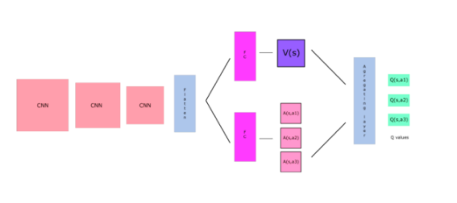

# •	Model Architecture and hyperparameters
To train the agent we worked on neural networks and we experimented the effect of different hyperparameters such as:
- **`1`** - Number of layers.
- **`2`** - Number of neurones.
# •	Agent hyperparameters
For the agent parameters we tried to make the best hyperarameters such as:
- **`1`** - Epsilon value.
- **`2`** - Discount factor.
- **`3`** - Batch size.
- **`4`** - Epsilon variation.

# •	Results
###1- First trial (Architecture)
For the first training of the DQN agent we implement the neural networks architecture as follow.

   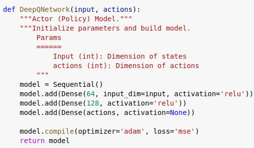

Then, we fixed the agent hyperparameters ( epsilon = 1 decreasing by 0.001 in each episode || discount factor = 0.99 || Batch size = 32)
In this case, we reached the 1200th episode but the score and average score were about -150 then ty started decreasing from the 1100 episode

   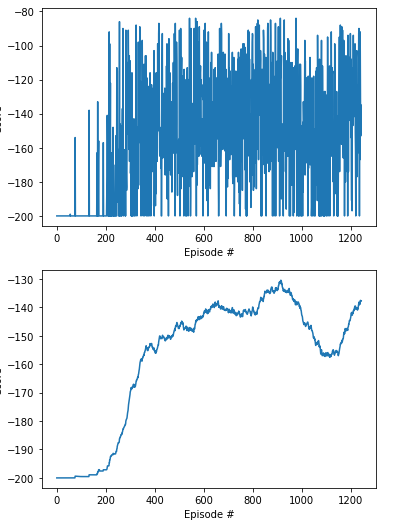

To know more about the power of improvement algorithms, we tried to train the agent with the same ANN architecture using the Dueling DQN.

   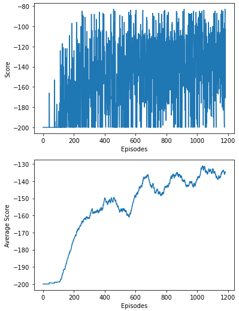

With the same number of episodes and ANN architecture, the average score reached -130.
###2- Second trial (Architecture)
In this trial, we chose to ameliorate the artificial newral networks architecture in order to reach positive scores.
We added to both layers a number of neurones and we restarted training

   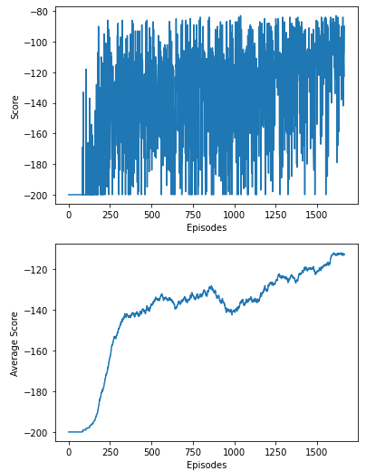

###3- Discount factor variation
In the first and second trial, and as mentioned, the discount factor was fixed to 0.99 which means that we gave to all rewards of the future the same importance.
We wanted to capture the effect of a small value of discount factor and we started training.
- **`1`** DQN
 
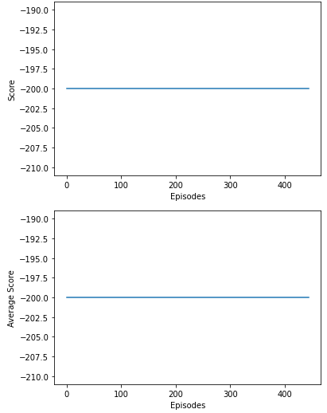

Unlike the first trainings, the scores and average scores didn't improve, so we realized that, for this example it is important to give attention to the future rewards.

- **`2`** Dueling DQN

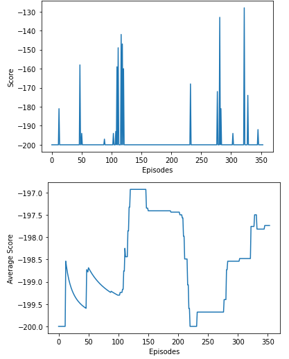

For the second time, the Duel DQN gives better results than DQN but still not the best because the average score didn't even increase to the value of -180

###4- Batch size
To test the effect of the batch size we trained the agent with a bigger batch.
In this case, the changing of the batch size didn't affect the convergence rate.
###5- Final step: Testing
- **`1`** DQN
 
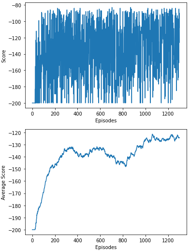

- **`2`** Dueling DQN

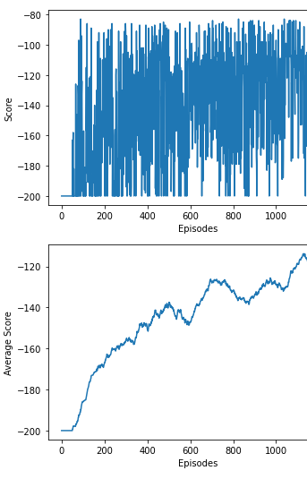

# •	Conclusion 
We can say that for the different experiments the Duel DQN is converging faster than the DQN.
That means that the agent is learning faster and more effectively with Duel DQN.
